<p align="center">
  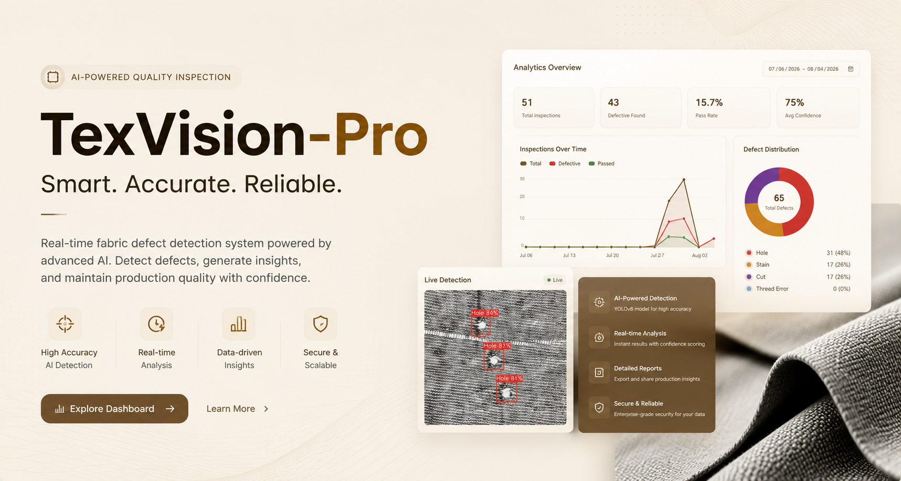
</p>

<h1 align="center">TexVision-Pro</h1>

<p align="center">
<b>Industrial Computer Vision Platform for Automated Fabric Defect Detection</b>
</p>

<p align="center">
A Software Engineering Final Year Project that combines deep learning, real-time object detection, edge deployment, and a modern web dashboard to automate textile quality inspection.
</p>

<p align="center">


</p>

---

# Overview

TexVision-Pro is an end-to-end industrial computer vision platform designed to automate textile quality inspection using deep learning and real-time object detection.

The system combines **YOLOv8-based defect detection**, **Flask**, **SQLite**, and **Raspberry Pi 5 edge deployment** into a modular inspection platform capable of identifying defects with speed, consistency, and reliability.

Unlike a standalone machine learning model, TexVision-Pro was engineered as a complete software system, integrating AI, backend development, data management, visualization, and deployment into a production-oriented workflow.

---

# Key Features

- Real-time fabric defect detection using YOLOv8
- Support for YOLOv8m and YOLOv8n models
- Live camera-based inspection
- Raspberry Pi 5 edge deployment
- Flask-powered management dashboard
- Inspection history and analytics
- User management system
- Modular software architecture
- Configurable training pipeline
- Industrial-oriented workflow

---

# System Architecture

<p align="center">
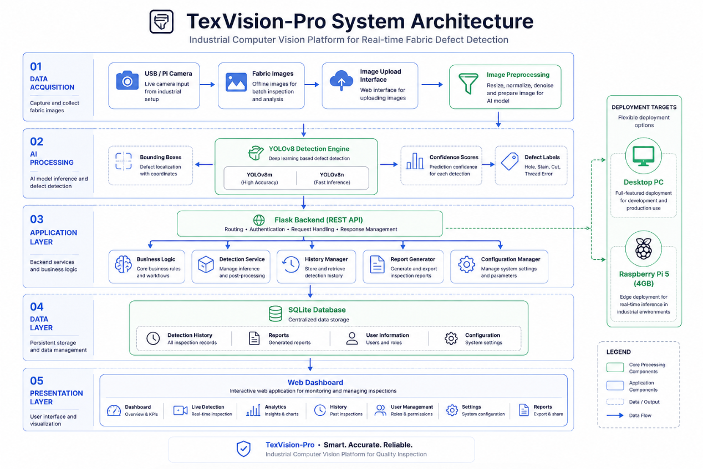
</p>

---

# Inference Pipeline

<p align="center">
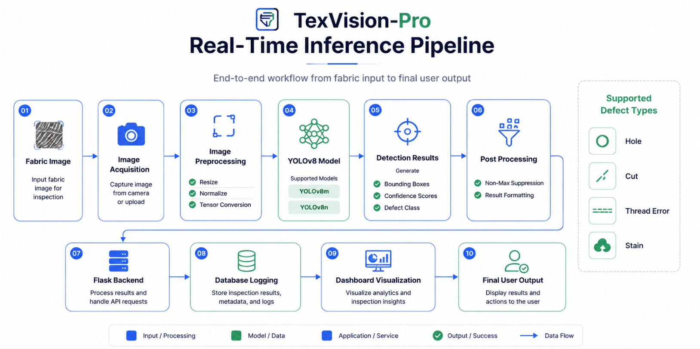
</p>

---

# Deployment Architecture

<p align="center">
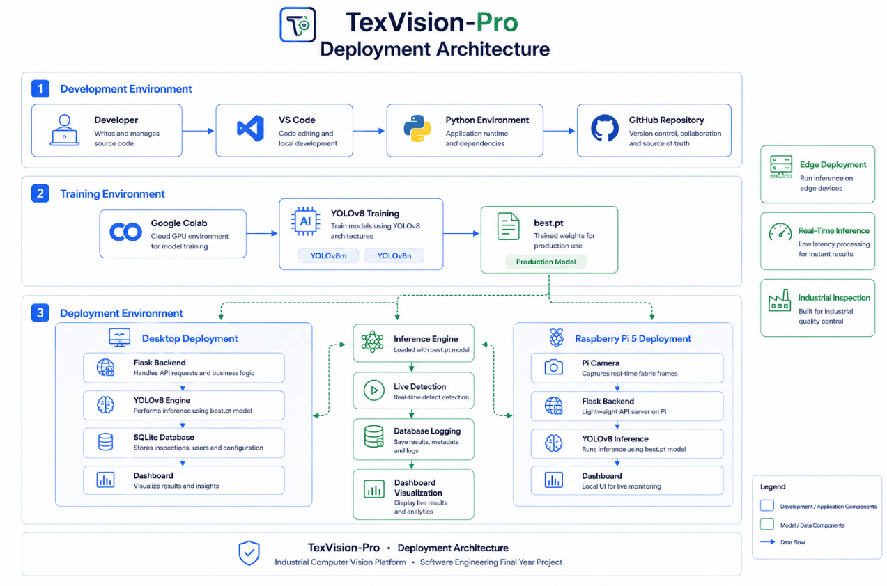
</p>

---

# Model Training Pipeline

<p align="center">
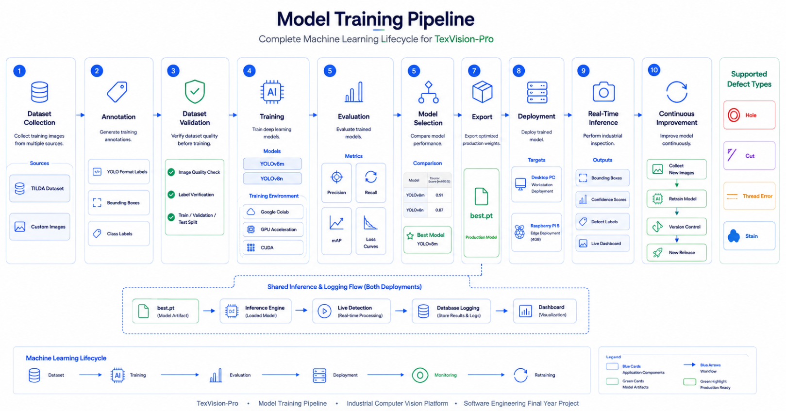
</p>

---

# Dashboard Preview

## Login

<p align="center">
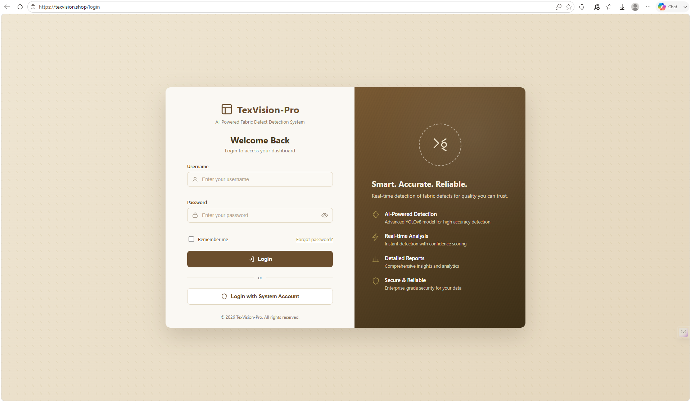
</p>

---

## Dashboard

| Dashboard | Detection |
|------------|------------|
| 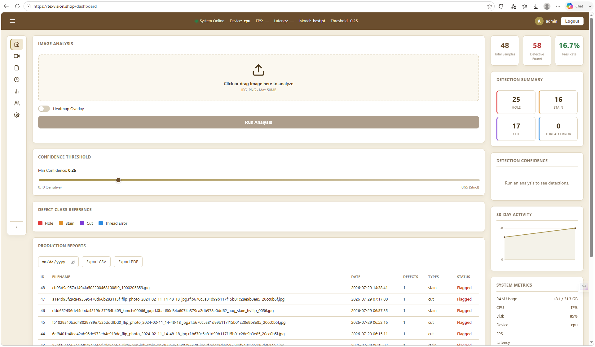 | 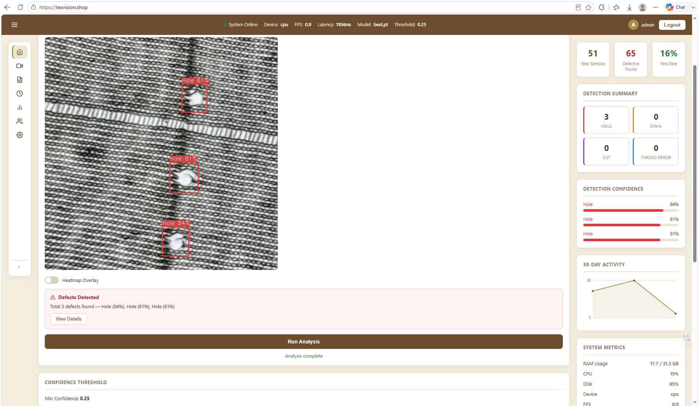 |

---

| Analytics | History |
|------------|------------|
| 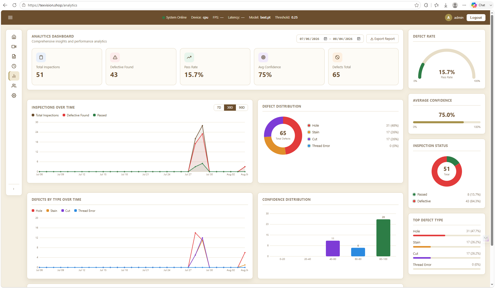 | 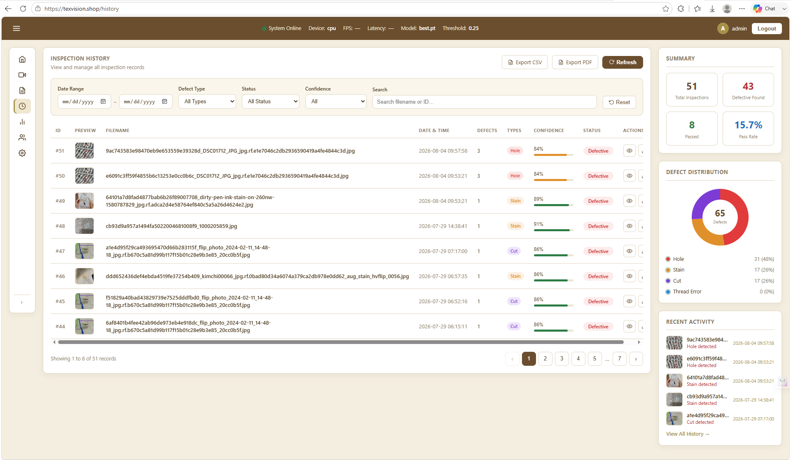 |

---

| User Management | Settings |
|------------|------------|
| 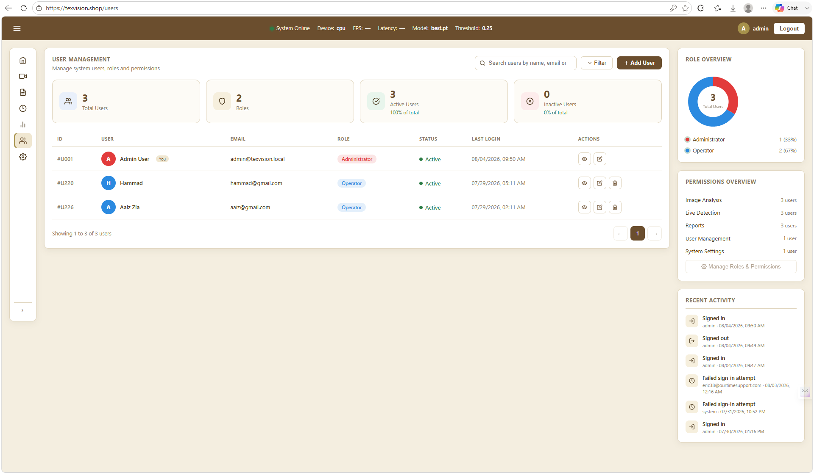 | 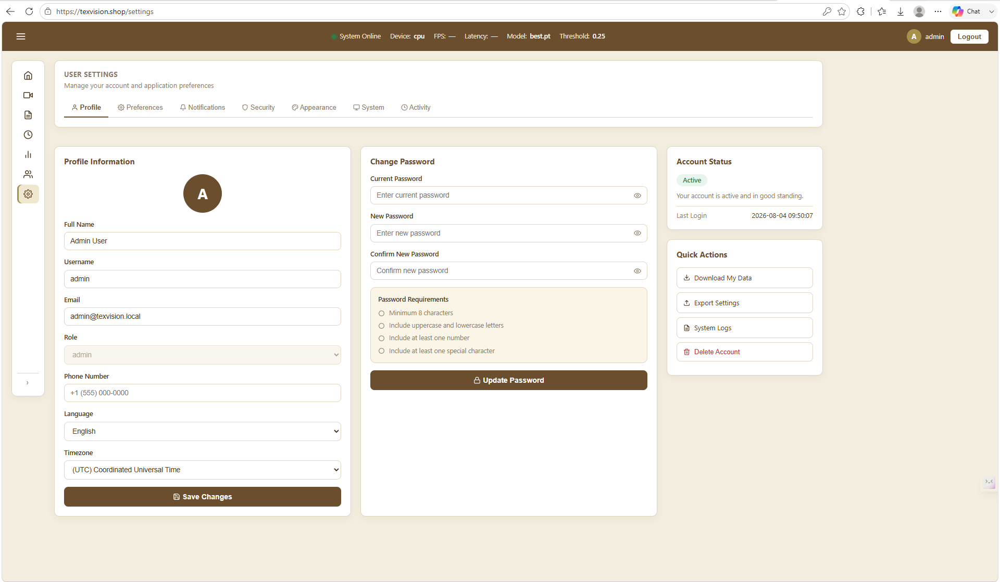 |

---

## Live Detection

<p align="center">
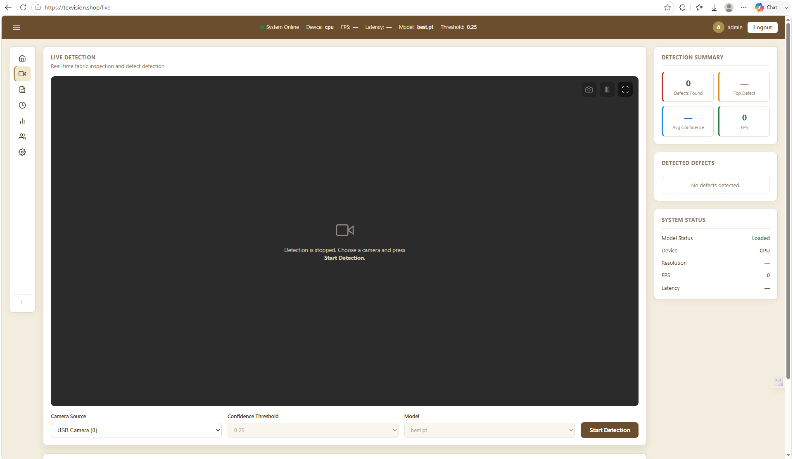
</p>

---

# Performance

| Model | Precision | Recall | Deployment |
|--------|----------:|-------:|------------|
| YOLOv8m | **94%** | **89%** | Raspberry Pi 5 / Desktop |
| YOLOv8n | **93%** | **88%** | Raspberry Pi 5 / Desktop |

---

# Technology Stack

| Category | Technologies |
|------------|-------------|
| Programming Language | Python |
| Computer Vision | YOLOv8 |
| Backend | Flask |
| Database | SQLite |
| Frontend | HTML, CSS, JavaScript |
| Edge Computing | Raspberry Pi 5 |
| Development Tools | Git, VS Code |

---

# Repository Structure

```text
TexVision-Pro
│
├── assets/
├── configs/
├── docs/
├── scripts/
├── src/
├── tests/
├── README.md
├── requirements.txt
└── LICENSE